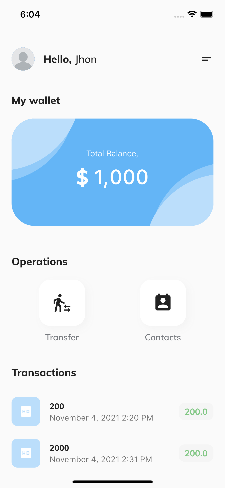

# flutter-app-example


[](https://opensource.org/licenses/MIT)

This project is an example for flutter mobile application. This repository contains source code and supporting files for a mobile application that you can build and test with Flutter. The application was developed based on [Alura](https://www.alura.com.br/formacao-flutter) course.

<p align="center">
  
</p>

## Getting Started

These instructions will get you a copy of the project up and running on your local machine for development and testing purposes. See deployment for notes on how to deploy the project.

### Prerequisites

- git
- flutter
- vscode
- Xcode
- Android Studio

After install the required tools follow the Flutter instructions, [click here](https://flutter.dev/docs/get-started/install).

### Installing

First of all you need to clone this repository:

``` bash
git clone https://github.com/claick-oliveira/flutter-app-example.git
```

After clone access the folder and you'll need to install de requirements:

```bash
cd flutter-app-example
flutter pub get
```

## Running the unit tests and analysis

To run the analysis execute:

```bash
flutter analyze
```

To run the unit tests execute:

> TODO: The tests is not done yet!

```bash
flutter test
```

## Build/Test the application

To build and deploy your application for the first time, run the following in your shell:

```bash
flutter run
```

## Resources

This project is a starting point for a Flutter application.

A few resources to get you started if this is your first Flutter project:

- [Lab: Write your first Flutter app](https://flutter.dev/docs/get-started/codelab)
- [Cookbook: Useful Flutter samples](https://flutter.dev/docs/cookbook)

For help getting started with Flutter, view our
[online documentation](https://flutter.dev/docs), which offers tutorials,
samples, guidance on mobile development, and a full API reference.

## Contributing

Please read [CONTRIBUTING.md](https://github.com/claick-oliveira/flutter-app-example/blob/main/CONTRIBUTING.md) for details on our code of conduct, and the process for submitting pull requests to us.

## Authors

- **Claick Oliveira** - *Initial work* - [claick-oliveira](https://github.com/claick-oliveira)

See also the list of [contributors](https://github.com/claick-oliveira/flutter-app-example/contributors) who participated in this project.

## License

This project is licensed under the MIT License - see the [LICENSE](LICENSE) file for details
